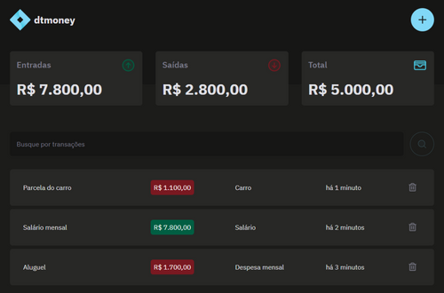

# dtmoney 🕰️

### Aplicação para simular um CRUD, é possível fazer um controle financeiro com as features



# Features

- ☑️ Cadastro de uma entrada e/ou saída de um controle financeiro
- ☑️ Dashboard com as informações de: Entradas, Saídas e Total (Entradas - Saídas)
- ☑️ Realizar um update dos dados já inseridos
- ☑️ Deletar uma entrada e/ou saída da listagem de itens

```bash
# Para clonar este repositório:
$ git clone https://github.com/bernardinorafael/dtmoney.git
```

```bash
# Acesse a pasta do projeto no seu terminal
$ cd dtmoney
```

```bash
# Instale as dependências
$ npm i
```

```bash
# Execute a aplicação em modo de desenvolvimento
$ npm run dev
```

```bash
# Execute o comando abaixo para ter acesso aos dados da API JSON-Server
$ npm run server
```

# Tecnologias

Projeto criado através do Vite, utilizando React e TypeScript

Algumas das tecnologias e libs utilizadas...

- [Axios]
- [Date-fns]
- [Phosphor]
- [Radix-UI]
- [React-Hook-Form]
- [React]
- [Styled Components]
- [TypeScript]
- [uuid]
- [Zod]
